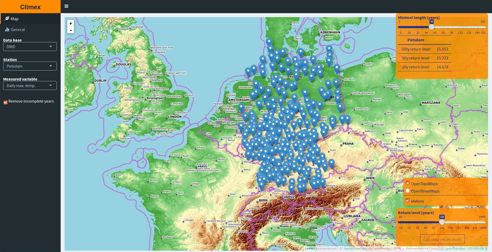
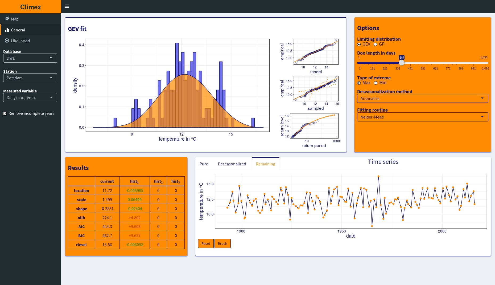

# Features




## An interactive web app


- You can perform extreme value analysis on a large number of
  climatic time series from different stations
- You can calculate arbitrary return levels for all 
  stations and display the results comprehensively on a map
  

- You have full control over all steps involved in the extreme value 
  analysis of the station data via an intuitive
  GUI in a persistent way (changes will be applied to the
  analysis of all following time series)
- Both the Generalized Extreme Value (GEV) and the Generalized
  Pareto (GP) approach are supported
- You can exclude single points or whole parts of a time series 
  with the entire analysis updated immediately
- The fitting is done using a nonlinear constrained maximum likelihood 
  procedure based on the augmented Lagrangian method. Using this approach
  none of your fits will produce numerical artifacts
  
[Try it!](http://climex.pks.mpg.de)

## A robust and sophisticated optimization (or why to use this package over others)

The fitting of GEV and GP parameters using unconstrained optimization (done by all other R packages on extreme value statistics) tends to produce numerical artifacts. This is due to the presence of logarithms in the negative log-likelihood and a limited range of shape parameters for which the likelihood estimator is defined. While producing absurdly large parameters or causing the optimization to fail when using the **BFGS** algorithm (*extRemes*) the differences using the **Nelder-Mead** algorithm (all other packages) might be small, barely noticeable, and totally plausible. 

In order to avoid those numerical artifacts, the **augmented Lagrangian method** is used to incorporate both the logarithms and the limited range of shape parameters as nonlinear constraints. With this approach the optimization can be started at arbitrary initial parameter combinations and will always converge to the global optimum. 

This solves two of the remaining problems of the extreme value analysis:
1. The user does not have to worry about the numerical optimization anymore. It will always produce the correct results
2. The optimization itself becomes more robust and can now be used in massive parallel applications

## Convenient access to the station data of the DWD

In order to obtain loads of data to perform the analysis on and to power the web application, this package contains some functions scrapping the web page of the German weather service (DWD). Even if you don't want to use the web app or the optimization routines, you might still appreciate either the .Rdata objects containing all these time series (of class *xts*) or the exported .csv versions of the individual station data.

# Installation

Since the [Shiny](https://shiny.rstudio.com/)-based web app uses rather new features of the R programming language, you have to have **at least R-3.3.0** or newer (you can check your version by running `R --version` in the terminal). If you don't fulfill this condition yet, be sure to get the binary or source of an appropriate R version via [CRAN](https://cran.r-project.org/).

In order to install this package you have to use the *install_github* function from the **devtools** package.

Just open a R shell on your computer and type the following commands

```
## Installing the devtools package (in case your haven't done it yet).
install.packages( "devtools" )

## Installing the climex package from Github.
devtools::install_github( "theGreatWhiteShark/climex" )
```

This will install the climex package residing on the **master** branch of this git repository. If you instead want to download and install a different branch, use the *ref* argument to specify it. E.g. 

```
devtools::install_github( "theGreatWhiteShark/climex", ref = "v1.0" )
```

Even if you do not intend to use the full capabilities of the package but just parts like the download of the DWD data, be sure to nevertheless install the whole package via the above commands. It just uses 1.4 MB of space and you this way you ensure that all required packages will be installed and all environmental variables will be set.

### Server-side installation of the Climex web application

You want to run your own version of the Climex web application on one of your servers so others can access it too? Then check out [this](res/shiny-server/README.md) configuration guide.

# Usage

You are new to **R**? Then check out the [compiled list of resources](https://www.rstudio.com/online-learning/#R) from RStudio or the [official introduction](https://cran.r-project.org/doc/manuals/R-intro.pdf).

An in-depth introduction to the [general usage](vignettes/data_dwd_and_usage.Rmd) of the package and the Shiny-based [web application](vignettes/climex_app.Rmd) can be found in the package's [vignettes](vignettes/).

When using this package in your own analysis, keep in mind that its functions expect your time series to be of class [xts](https://cran.r-project.org/web/packages/xts/index.html) and not numeric!

### Why is this not on [CRAN](https://cran.r-project.org/)?

The CRAN project has some special requirements a package has to fulfill to be hosted on their web page. One of those is for the package to complete the R package check without raising a single warning. Unfortunately I don't see a way right now to rewrite the function _climex::climex_ in such a way it fulfills this requirement and I most certainly don't want to drop it. CRAN is just not meant to host a variety of more complex Shiny apps yet. ;)

---

### License

This package is free software; you can redistribute it and/or modify it
under the terms of the GNU General Public License, version 3, as
published by the Free Software Foundation.

This program is distributed in the hope that it will be useful, but
without any warranty; without even the implied warranty of
merchantability or fitness for a particular purpose.  See the GNU
General Public License for more details.

A copy of the GNU General Public License, version 3, is available at
<http://www.r-project.org/Licenses/GPL-3>


