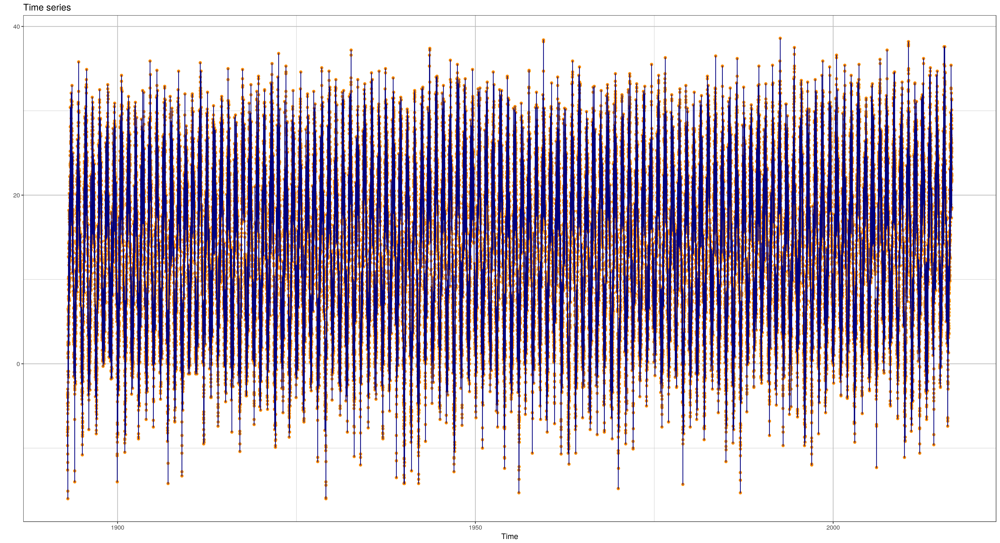
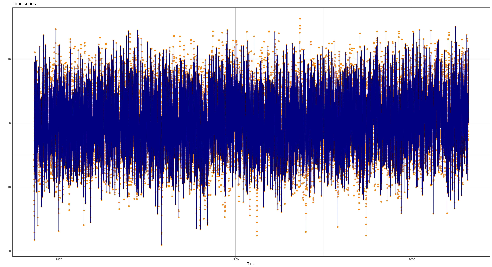
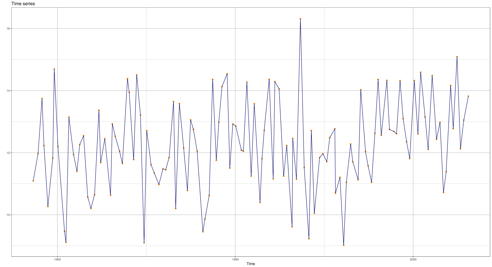
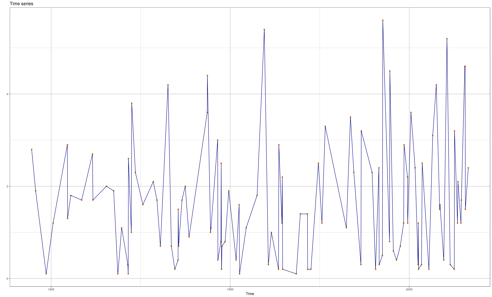
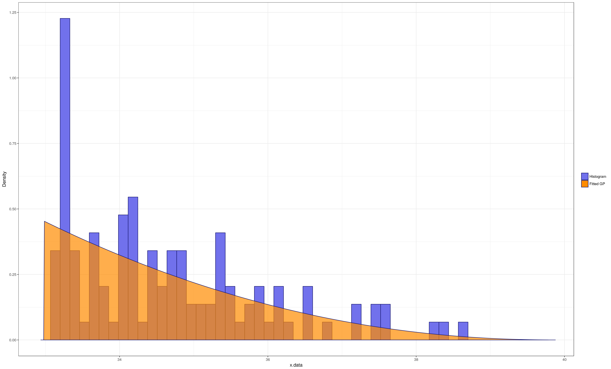

# About
This vignette provides an introduction into the basic usage of the **climex** package:

1. The download and formatting of all the station data provided by the
   German weather service (DWD) will be described (optional, but handy if
   you haven't build up your own data base yet).
2. The preprocessing of time series and fitting of the generalized
   extreme value (GEV) and generalized Pareto (GP) distribution is explained.

The usage of the Shiny-based climex web app will be covered in another vignette.

# Downloading and formatting of the station data of the DWD

Since this package is intended to be used with climatic data, it comes with a function to download and format all station data provided by the [German weather service (DWD)](http://www.dwd.de/DE/Home/home_node.html). I chose the daily measured time series since a finer temporal resolution would not make much sense in the context of extreme value analysis.

Before using the data please read the [terms of use](ftp://ftp-cdc.dwd.de/pub/CDC/Terms_of_use.pdf) carefully.

This package, as well as its Shiny app, can be used without downloading any data. So if you already have your own data base, feel free to skip to the next chapter.

## Prerequisites 

By default the downloaded data as well as all the app's resources will be stored in your home in folder called *~/R/climex/*. If you don't like the name of the folder or have your own way of arranging your local folder structure, fell free to change its path by adding the following lines to your R configuration file *~/.Rprofile* in your home.

```{r configuration, eval=FALSE}
## Replace PATH by the directory you want to store all files related to the climex app into
options( climex.path = "PATH" )
```

## Downloading

In the second step open a new R konsole, load the climex package and run the function downloading and formatting all the station data.

```{r downloading, eval = FALSE, cache = TRUE, dependson = "prerequisites"}
## Loading the climex package
library( climex )
## Download and format the station data. This may take a while.
download.data.dwd()
```

This will create a folder in `getOption( "climex.path" )` called **download_dwd**
containing the mirrored content of the daily measured station data
from the DWD's FTP server. Those .zip files will be extracted, parsed
and converted to
the [xts](https://CRAN.R-project.org/package=xts)
format one after another. The parsing takes some time and can last for
several minutes depending on your machine's specifications. 

To avoid
saving the raw data the argument *save.downloads* can be set to
FALSE. But it is recommended to keep the default value of TRUE since the function will
compare the time stamps of the files on the FTP server against the
ones of the local copies. Running this function another time will thus
update your existing data base without downloading all the content again.

By default three different types of data will be extracted: the daily maximal and minimal temperature and the daily precipitation. Using the *data.type* argument one can obtain a variety of additional information from the DWD data base. There are several stations with missing data or for which specific types of measurements are not available at all. In the original time series those were set to -999 but during the formatting they are replaced by NA to avoid numerical artifacts. Please be aware that these steps will use the *mclapply* function of the [parallel](https://stat.ethz.ch/R-manual/R-devel/library/parallel/doc/parallel.pdf) package starting threads on all your machine's cores to enhance the speed of the import.

After parsing the data will be saved as lists of objects of the class **xts** and written to the *climex.path/dwd_downloads* folder in R's binary format .RData.

In addition there is the *csv.export* option exporting the lists of xts data to .csv files which can be imported into any other application. For each chosen data source in the *data.type* character vector a new folder will be created containing the data of each single station in a different file. 

## Loading the data
Since the data will be stored, you do not have to repeat this step every time you want to load the data.

```{r dwd-loading, eval = FALSE, cache = TRUE, dependson = "downloading"}
source.data()
```
If the *pick.default* option is set to TRUE it will just look for the default station data (containing the maximum and minimum daily temperature as well as the daily precipitation). If the option is set to FALSE an interactive choice we be prompted instead.
This will print all existing .RData files in the
*climex.path/dwd_downloads* folder and let the user choose which one to
import. As an alternative one of course can just use the plain
*load()* function from the **base** package.

# Preprocessing and fitting

Now that we have enough data, let's do some extreme value analysis. 

The climex package at its current stage is intended to provide tools for fitting both the GEV and GP distribution in a stationary setting. Since the workflow differs depending on which limiting distribution is considered, I will cover both use cases in consecutive parts starting with the GEV one.

For a thorough and didactic introduction into the concept of the extreme value theory please refer to the book of Stuart Coles "An Introduction to Statistical Modeling of Extreme Value", 2001 Springer.

For the sake of convenience all the analysis will be performed on the daily maximum temperature time series of the Potsdam station in Germany provided by the climex package via the variable **temp.potsdam**. This way you can follow this tutorial regardless of your choice whether or not to download the DWD data collection.

```{r loading, cache = TRUE, dependson = "prerequisites"}
require( climex )
data( temp.potsdam )

## convenience function for plotting xts class time series using ggplot2
ttplot( temp.potsdam )
```


## The GEV distribution

The essence of this branch of extreme value analysis is to split a time series into equally sized blocks and extract just each of their maximal values. Those values will then be fitted using the maximum likelihood function of the generalized extreme value (GEV) distribution. In most use cases, especially when working with temperature series, the block length will be set to one year to get rid of the seasonality in the data.

#### Removing incomplete years

Since we are extracting the maximum value for each year, it is quite important that all our years are actually complete. Imagine for one year just data from January and December is available. Then the maximum value would of course be quite a huge artifact leading to wrong GEV parameters in the fit. 

A quite straight forward way to circumvent this problem is to remove all incomplete years from your time series. This will of course shorten your time series and is quite over the top when just one or two days are missing. But on the other hand it is a rather convenient way to ensure the validity of your analysis when you want to perform your extreme value analysis in a massive parallel setting where the exploration of each individual time series becomes intractable.

```{r incomplete-years, cache = TRUE, dependson = "loading"}

temp.potsdam.complete <- remove.incomplete.years( temp.potsdam )

ttplot( temp.potsdam.complete )

```


#### Discard short time series

Just a remark: If we would deal with all the different station data of the DWD
downloaded in the first section, an additional second step discarding
all time series containing less than 30 years would be required. Since
we want to extract the annual maxima we would end up with less than 30
points to fit the three GEV parameters in a later step otherwise. And
with this small number we would not be able to do decent statistics. 

#### Removing seasonality

One of the basic assumptions within the extreme value theory is that
the time series is stationary and does not contain any
correlations. It is a rather bold approximation (especially in the
context of the [climate change](http://onlinelibrary.wiley.com/doi/10.1002/2016GL069555/full)), but our hands are tied when it comes to alternative approaches to estimate the return levels of our time series. So bite the bullet and assume that our time
series is indeed stationary and does not contain any long-range correlations. But there is still a very prominent short-range correlation present in e.g. the temperature: the annual cycle. We will get rid of it by calculating the [anomalies](https://en.wikipedia.org/wiki/Anomaly_(natural_sciences)). Therefore we calculate the mean value of each day and subtract it from the individual ones. 

```{r anomalies, cache = TRUE, dependson = "incomplete-years"}

temp.potsdam.anomalies <- anomalies( temp.potsdam.complete )

ttplot( temp.potsdam.anomalies )

```



Though you have way more data contributing to the analysis (you can
not expect the hottest day of the year to occur during winter) and
thus the asymptotic properties of the GEV distribution are more likely
fulfilled (quarter-annual block may be already sufficient), the interpretation of the extreme events in those anomalies
is more difficult than in the raw series. 

So whether you perform this step of the preprocessing or not depends on the your application at hand.

#### Blocking

In the final step of our preprocessing we will separate the time
series in annual blocks and extract their maximal values. Even if there are some short-range correlations left in the data, through the annual cycle or other sources, this still will get rid of them.

```{r blocking, cache = TRUE, dependson = "anomalies"}

## Per default the block length of the block() function will be one year
temp.potsdam.blocked <- block( temp.potsdam.anomalies )

ttplot( temp.potsdam.blocked )

```




#### Fitting the GEV distribution

After we extracted all the extreme events from our time series, it's time to fit the GEV distribution to them. In addition we will also calculate the 100 year return level of the time series.

```{r fit, dependson = "blocking"}

## The result will be a list of objects similar to the output of the
## optim function.
gev.potsdam <- fit.gev( temp.potsdam.blocked )

gev.return.level.potsdam <- return.level( gev.potsdam )
print( gev.return.level.potsdam )

## another convenience function to easily bundle plots
multiplot( plotlist = list( ttplot( temp.potsdam.blocked ),
                           plot( gev.potsdam ) ), cols = 2,
          main = "Blocked temperature anomalies and GEV fit" )

```


## The GP distribution

Even though the individual step in the GP approach differ from the GEV one, the overall character of the analysis is very similar. Again we want to have as much data as possible but still fulfill our asymptotic conditions enabling us to fit the extreme event with the limiting distribution and we have to get rid of the short-range correlation. Therefore I will provided a little bit more condensed version of an explanation compared to the last section.

The main difference compared to the previous approach, apart from fitting the likelihood function of the GP instead of the GEV distribution, is that we now apply a threshold to our time series. All events above this threshold will be considered as extreme events in our analysis.

#### Removing short-range correlations

Especially considering climate time series it's quite evident that there will be short-range correlations in our time series when we just consider threshold exceedances. We all experienced heat waves or consecutive daily of heavy raining. 

To prevent these correlations from interfering with our analysis, we have to decluster all the point obtained by applying the threshold. The declustering function now takes a look on the time stamps of all exceedances and searches for gaps of at least the size of a predefined length, let's called it x for now. All exceedances being not separated by at least x point, which were below the threshold, will be grouped into one cluster. If we would face a heatwave with consecutive daily maximal temperatures of let's say 30, 31, 32, 29, 29, 33, and 30 degrees Celsius with our threshold at 29.5 degrees and our x equal 3, all seven days of the heatwave will be considered as one single cluster.

After grouping all exceedances into clusters, only the maximum value of each of them is extracted and fitted by the GP distribution.

We fortunately do not have to set our x manually but it will be determined by using the extremal index (see [Ferro & Segers, 2003, Journal of Royal Statistical Society, Series B.](http://onlinelibrary.wiley.com/doi/10.1111/1467-9868.00401/full)).

```{r decluster, cache = TRUE, dependson = "loading"}
## By default the threshold function of the climex package will decluster your
## time series. You can disable it by setting the decluster argument to FALSE
temp.potsdam.declustered <- threshold( temp.potsdam, threshold = 33 )

ttplot( temp.potsdam.declustered )
```



#### Fitting the GP distribution

After we obtained our extreme events by applying a sufficiently high threshold to our time series and declustering the resulting point, we will the likelihood function of the generalized Pareto (GP) distribution to our data using the maximum likelihood approach and determine the 100 year return level.

```{r gp-fit, cache = TRUE, dependson = "decluster"}
## Fitting the GP distribution
## Since in the default setup the return level will be calculated not in
## units of times but numbers of exceedances, we have to provide the
## length of the original time series to rescale our return level to
## years.
gp.potsdam <- fit.gpd( temp.potsdam.declustered, threshold = 33,
                      total.length = length( temp.potsdam ) )

gp.return.level.potsdam <- gp.potsdam$return.level
print( gp.return.level.potsdam )

## another convenience function to easily bundle plots
multiplot( plotlist = list( ttplot( temp.potsdam.declustered ),
                           plot( gp.potsdam ) ), cols = 2,
          main = "Declustered daily maximum temperature and its GP fit" )
```


