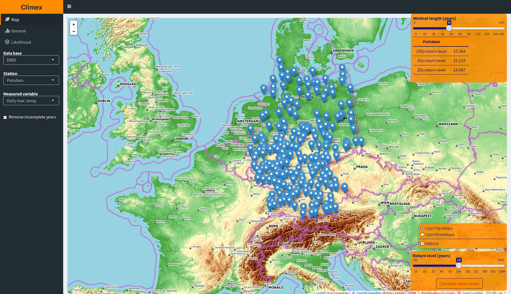
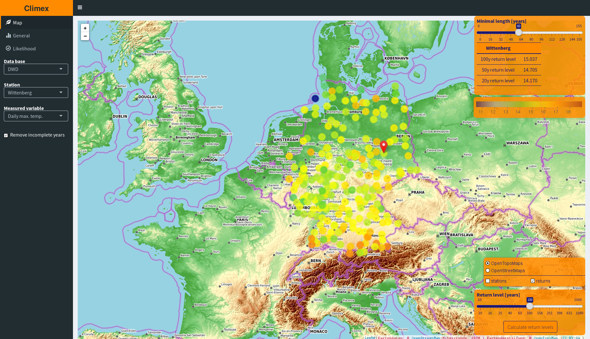
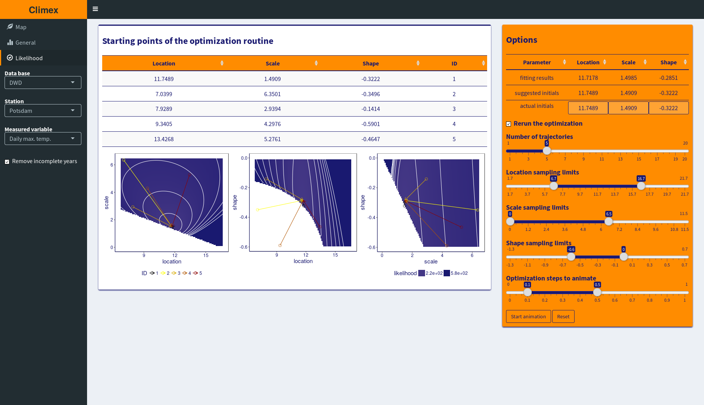

# About
This vignette describes the basic functions of the package's web application. Its main purposes are
- To allow the user to interactively and persistently alter the default preprocessing and fitting options for the maximum likelihood fit of the generalized extreme value (GEV) distribution 
- To apply it consistently to many different time series.
- To verify the validity of the optimization procedure using a variety of goodness of fit plots and an animation of the actual optimization procedure.


# Prerequisites
First of all the global variable **CLIMEX.PATH** has to be set. Just add the following lines to ~/.Rprofile

```{r prerequisites, cache = TRUE}
CLIMEX.PATH <<- "~/R/climex/"
if ( !dir.exists( CLIMEX.PATH ) )
    dir.create( CLIMEX.PATH, recursive = TRUE )
```

Afterwards the web app is invoked locally by calling the *climex()*
function and browsing to the shown IP address (e.g. `firefox http://127.0.0.1:3838`)
```{r wrapper, eval = FALSE, dependson = "prerequisites"}
require( climex )
climex()
```
This function will copy several assets into the **CLIMEX.PATH** folder which will also contain the images necessary to create the animations.

#  Map tab



This leaflet-based tab is the default entry point of the climex app and its main
purpose is the navigation between different time series. 

While working with tens or hundreds of time series from different
geographical sites it is always hard to keep their spatial relations
like the distance between the stations or their individual altitude in
mind. To overcome this problem I introduced a map based selection
interface in addition to the *Stations* selector in the sidebar.

Whenever you supply a list containing both a named list of time
series of class **xts** and a data.frame with the columns *longitude*,
*latitude*, *altitude*(not used at this current stage) and *name* of
the individual station their position will be marked in the
**Map**-tab.

Alternatively one can also choose to work with artificial data by
setting the *Data base* selector accordingly or to provide a single
**xts** time series as the input of the climex() function call.

In addition this tab offers several other features:

- Via the *Minimal length* slider only those time series contain more
  years than the chosen value will be shown on the map. This feature
  is extremely useful for finding long time series in the vastness of
  all your provided station data.
- When selecting a station via mouse click a summary statistic containing the
  stations name as well as its 20, 50 and 100 year return level will
  be displayed in the upper right corner of the map.
- Using the *Return level* slider the chosen return level will be
  calculated for all shown stations and displayed using colored circle
  markers. But beware: this can take up to several minutes depending
  an the number of stations displayed
  


All the changes to the preprocessing and fitting setting in the
**General** tab will be considered while calculating the summary
statistics and the return level of all displayed stations.

#  General tab


This tab provides both an interface to change the preprocessing and
fitting options used throughout the whole application as well as a
variety of tools to analyze individual time series.

### The **Time series** box

In the *Pure* tab of this box you can view the raw and unprocessed
time series. The *Deseasonalized* tab uses the former series and
applies the function specified in the *Deseasonalization method*
selector of the **Options** box to it. Both plots contain the
extracted extreme events as additional orange points and are generated
using the **dygraphs** library. That's why you are also able so zoom
into specific regions of the series using your mouse.

The *Remaining* tab contains all the events in your time series which
are extracted by the blocking or point of threshold method. Those can
be considered the extreme events of the time series. Since it is
sometimes quite interesting to see what will happen to your fitted GEV
parameter when discarding individual events (like the most extreme
one) you can toggle all the points by clicking on them or brush them
using your mouse. When deactivated they do not contribute to the GEV
fitting anymore.

### The **GEV fit** box

This box contain four different plots: 

- The overall fitting result consisting of a blueish histogram of the
  extreme events of the time series and the orange-colored GEV density
  function constructed using the fitted GEV parameters.
- Three goodness-of-fit plots highlighting the quality of the
  individual fit. From top to bottom: p-p plot, q-q plot, return level plot.

### The **Options** box

Via the settings in this box all the preprocessing of the time series
and the fitting of the extreme events are controlled throughout the
app.

#### Blocks vs. Threshold

This radio button controls rather to fit the generalized extreme value
(GEV) distributions (*Blocks*) or to fit the generalized Pareto (GP)
distribution function.

#### Box length in days | Threshold

The actual meaning of this slider is determined by the previous
*Blocks vs. Threshold* radio button. If set to *Blocks* it will be
called *Box length in days* and determines the number of days of a time
series which constitute a block in the GEV approach. The default value
of one year is recommended especially since the user can change the
deseasonalization method and may end up with seasonal correlations in
the data.

If set to *Threshold* the slider determines the height of the
threshold above which all event will be considered to be extreme
events.

Remember: both the approximation of the histogram using the GEV and
the GP distribution is only valid for asymptotic block length and
threshold height. So don't pick to low values!

Worth mentioning there is also the "Removing incomplete years* or
*Declustering of the data* radio button in the sidebar (depending of
the choice between *Blocks vs. Threshold*) which become very handy
when dealing with real world data.

#### Type of extreme

If set to *Min* the most lowest values of each block or all events
below a certain threshold will be considered extreme events. 

#### Deseasonalization method

Using this selector you can choose if and how to get rid off the
short-range correlations in your time series introduced by the annual
cycle. Per default the anomalies will be calculated but you can also
pick another R based implementation. For the description of these
methods please refer to their individual documentation.

#### Fitting routine

It is recommended not to touch this selector unless you really know
what you are doing. After some careful analysis the author showed the
*Nelder-Mead* algorithm to be the best method to fit the GEV
parameters.

### The **Results** box

This table displays several details of the GEV fitting procedure

- The three GEV parameters *location*, *scale* and *shape*
- The negative log-likelihood (*nllh*) of the fit as well as the
  Akaike and Bayesian Information criterion
- The 100 year return level

For location, scale, shape and return level a small change while
varying the preprocessing or fitting parameters does shows the  stability
of the fitting procedure and the high quality of the time series. This
will be indicated in green color whereas large changes are indicated
with red. For the nllh, AIC and BIC the values should be as low as
possible. That's why all decreases are marked green and all increases
red.

To better review the influence of the individual parameter changes not
just the current results and statistics but also the ones from the
three last fits (in the *h_1*, *h_2* and *h_3* column) are contained
in the table.

#  Likelihood tab



It is not uncommon for the fitting procedure to get stuck in some
local minimum while optimization and because of this leading to
insufficient GEV parameter approximations. To circumvent this problem
the climex app will start the optimization at five different sites and
displays their path in the 3D parameters space of the GEV
distribution. The first path (colored in black) is always the one
actually taken during optimization. Using this approach you can
visually verify if the optimization got stuck at a different point
compared to the other routes or if all of them lead to the same
result.

### Staring points of the optimization routine

As the name suggests this table holds the five initial positions the
optimization is started from in the animation. The first one will be
painted black and the IDs correspond to the ones color-coded in the
animation.

### Options

In the table on top of the **Options** box you see the initial
parameters suggested by an heuristic used in the optimization
procedure, the fitted parameter combination and the ones actually used
to initialize the optimization. The later ones you can modify. By
doing so you will also affect all other components regarding the fit
of the individual time series you are working on.

Using the variety of sliders below the table you can change the number
of paths you want to have in your animation, the parameter range the
initial parameters are drawn from and the part of the optimization you
want to have presented in the animation. Since it is quite common for
a fitting routine to do a lot of minor updates in the end you should
not view the whole optimization.

The *Reset* button will draw a new set of initial points while the
*Start animation* button renders the plots for the animation. The
later task can last up to several minutes.


# Deploying the app on server side

When you want to not just locally use this app but also provide it as
a server you have to install and
configure [Shiny-Server](http://docs.rstudio.com/shiny-server/).

Then you have to copy all files from *res/shiny-server/climex* to
*/srv/shiny-server/climex* and all files from
*res/shiny-server/assets* to */srv/shiny-server/assets*. 

If you in addition want to provide the station data of the German
weather service downloaded in the other vignette of this package you
have to copy its download directory to */srv/shiny-server/assets/downloads_dwd*.

---
Icons: © [Glyphicon](http://glyphicons.com/) [CC-By-SA](https://creativecommons.org/licenses/by-sa/3.0/)
